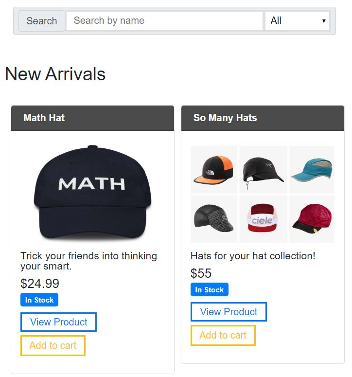
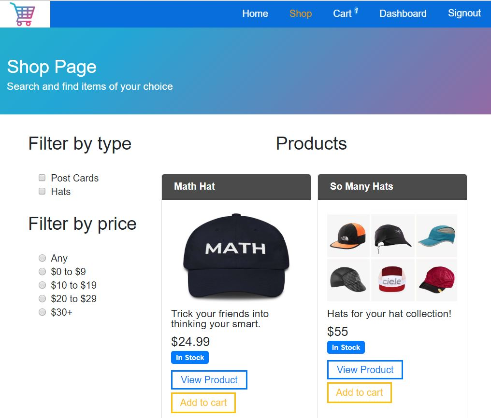
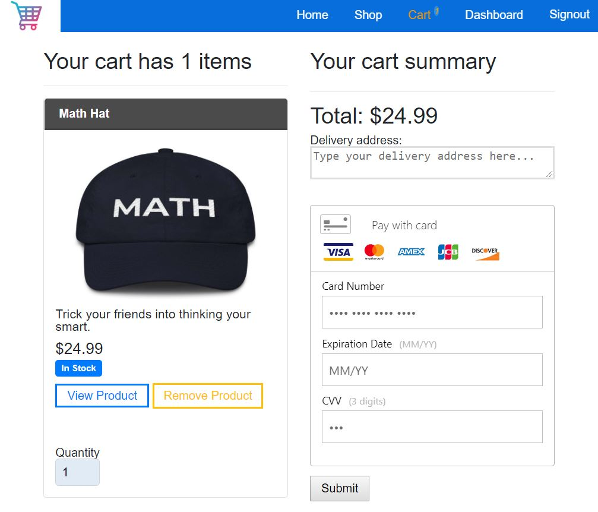
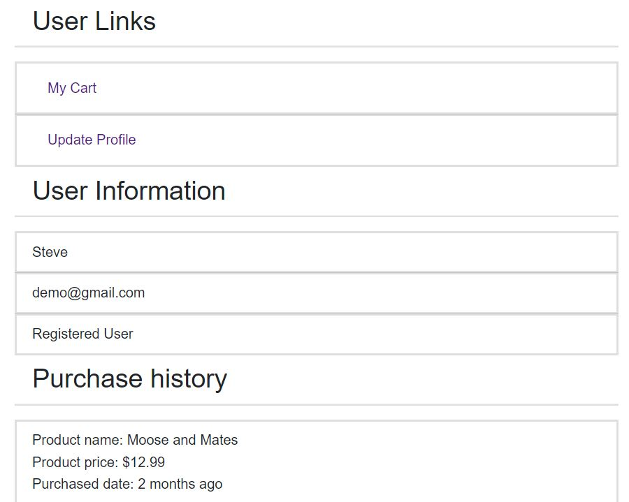
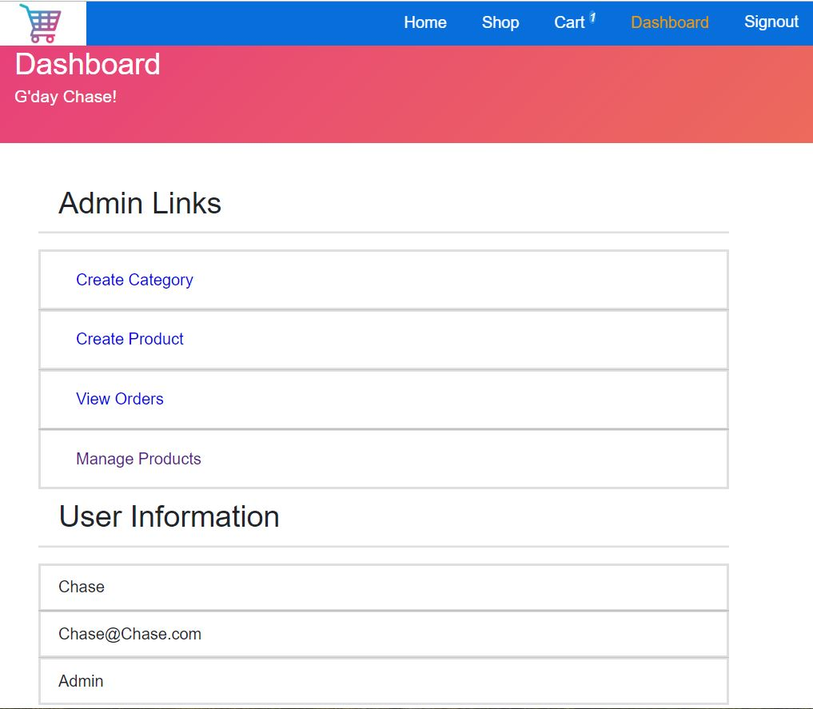

## Ecommerce Website Template

## Live - https://blissful-sinoussi-600253.netlify.com/

## Summary 
This e-commerce website was designed as a template for anyone that wants to sell products. 
It was made to have all the basic features you would expect from an e-commerce website as well as features that let the admin add/delete and change products for the shopping page. It includes a purchase summary page for user and admin. The front end is deployed from Zeit and backend with Heroku.  

## Tools
 - React
 - Braintree – for implementing paypal and credit information
 - Netlify
 
## How it works

- **Create account or use auto filled test account, then sign in.**

 
 - **From the Home page you can view new arrivals and best sellers.**
 

 
 - **From the Shop page you can pick filters for going through products.**
 

 - **From the shopping cart you can checkout your order.**
 

 - **From dashboard, User can view cart or update profile.**
 

 - **From dashboard, admin has ability to add/delete/change products and view orders**
 
