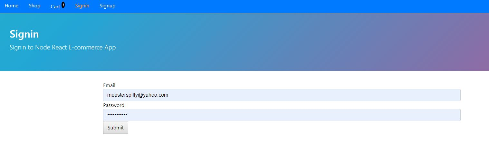
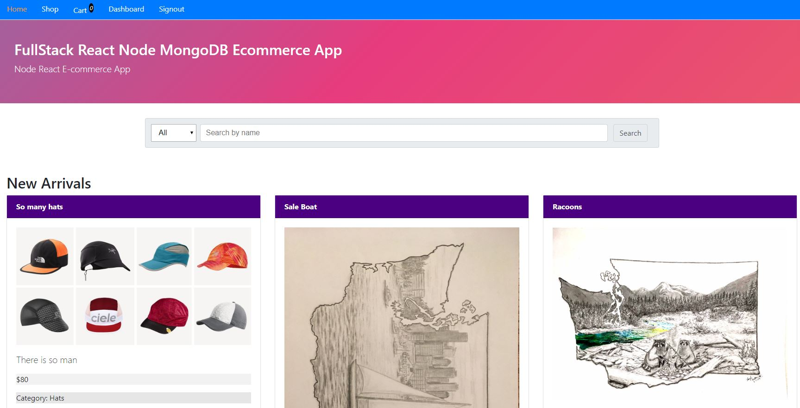
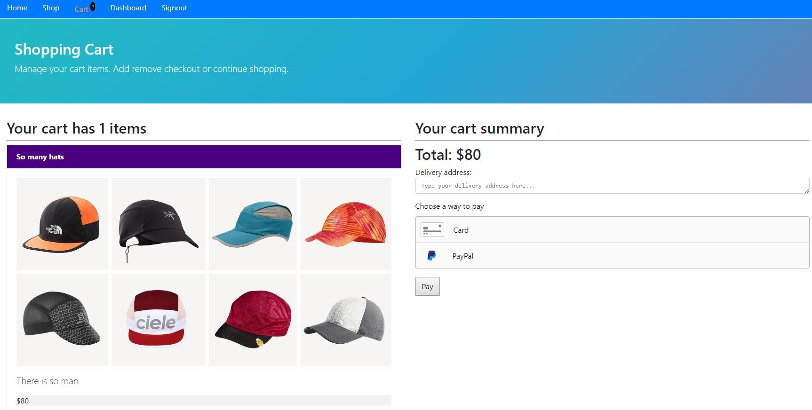
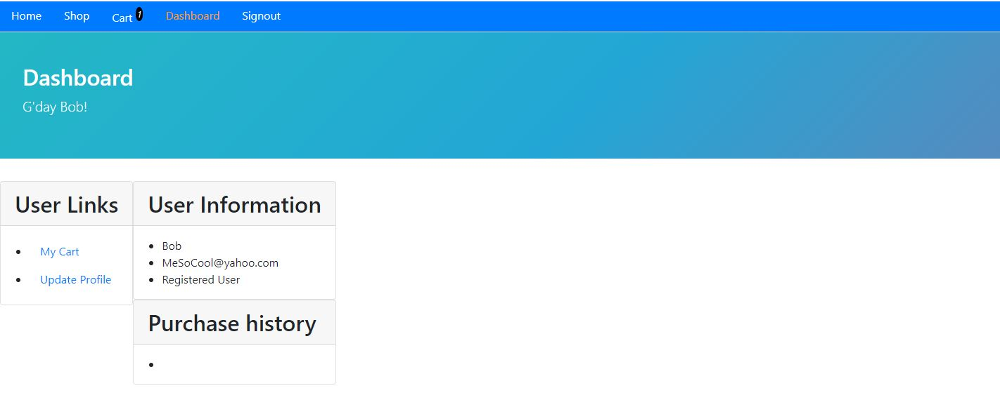
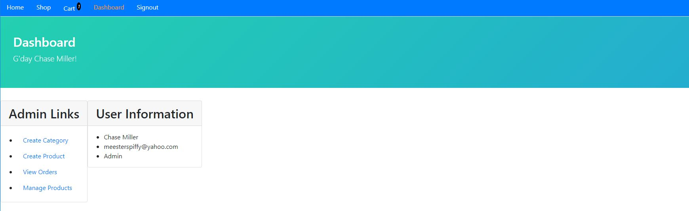

## Ecommerce Website Template

## Live - https://ecommerce-app-r5r9ffxea.now.sh/

## Summery 
This e-commerce website was designed as a template for anyone that wants to sell products. 
It was made to have all the basic features you would expect from an e-commerce website as well as features that let the admin add/delete and change products for the shopping page. It includes a purchase summary page for user and admin. The front end is deployed from Zeit and backend with Heroku.  

Software used:
 React
 MongoDB 
 Node.js
 Braintree – for implementing paypal and credit information
 Heroku
 Zeit
## How it works

Create account, then sign in.

From Homepage you can view new arrivals and best sellers.

From shop you can pic filters for going through products

From the shopping cart you can checkout your order. Options for payment include credit card or Paypal. 

From dashboard, User can view cart or update profile

From dashboard, admin has ability to add/delete/change products and view orders

